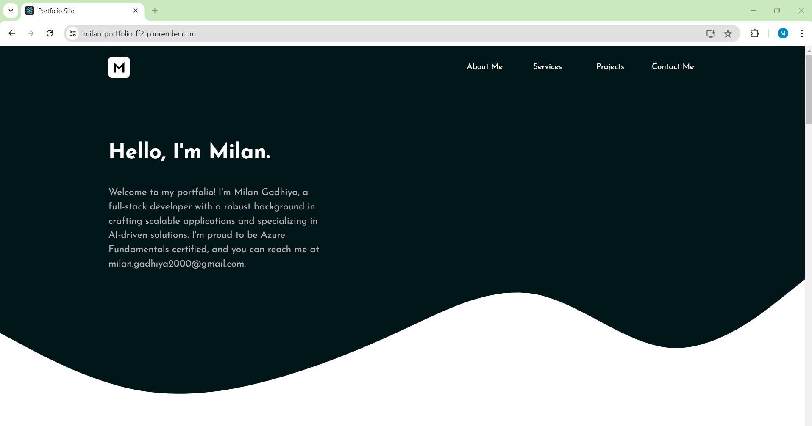
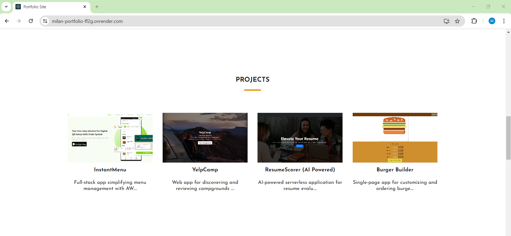
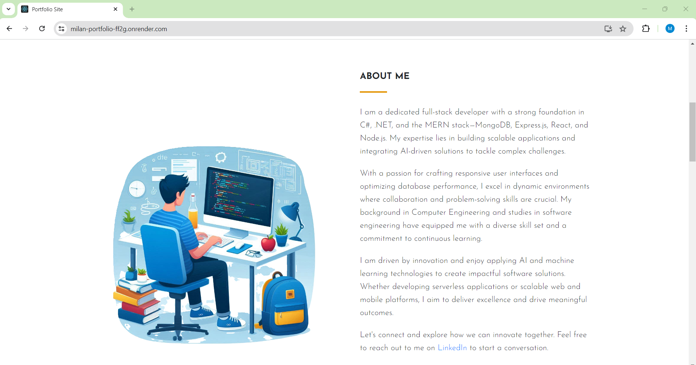
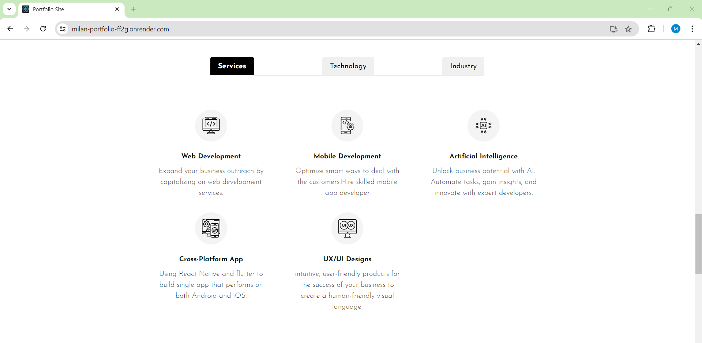
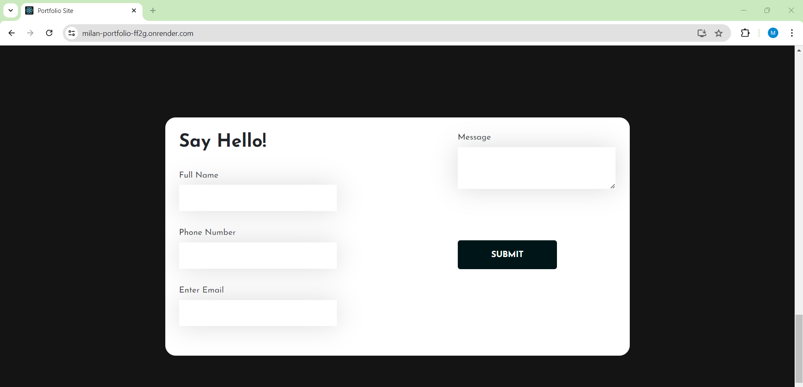

# Portfolio

## Table of Contents
- [Introduction](#introduction)
- [Features](#features)
- [Launch](#launch)
- [Screenshots](#screenshots)
- [Technologies](#technologies)
- [PortfolioLink](#portfoliolink)

## Introduction
This portfolio project showcases my skills, experience, and projects as a software developer. It is a single-page application that provides information about my professional background, technical skills, and a selection of my work. The project is built using modern web development technologies and best practices.

## Features
- **About Me:** Everyone can view campgrounds and their reviews without needing to sign up or log in.
- **Projects:** Users must log in to create a new campground or to leave a review.
- **Skills:** Users can only edit or delete the campgrounds and comments that they have posted.
- **Contact:** All user data, campground details, and comments are persistently stored in the Amazon cloud.
- **Responsive Design:** The portfolio is fully responsive and looks great on all devices.

## Launch

### Setup
1. Clone the repository
2. Install the dependencies

```bash
git clone https://github.com/Milan-Gadhiya/Portfolio.git
cd portfolio
npm install

```

Create a .env file in the root of the project and add the following:

```bash
DATABASE_URL='<your_mongodb_connection_string>'
```

Start the development server
```bash
npm start

```

Open http://localhost:1000 to view it in the browser.


## Screenshots
- **HomePage**
  

- **Projects Section**
  

- **About Me Section**
    

- **Skills Section**
  
  
- **Contact Form**
  

## Technologies
- **React:** A JavaScript library for building user interfaces.
- **Redux:** A predictable state container for JavaScript apps.
- **Axios:** A promise-based HTTP client for the browser and Node.js.
- **Bootstrap:** A front-end framework for developing responsive and mobile-first websites.
- **HTML5:** The standard markup language for creating web pages.
- **CSS3:** Used for styling and designing the web pages.
- **JavaScript:** A programming language used to create dynamic website content.
- **Node.js:** An open-source, cross-platform, JavaScript runtime environment that executes JavaScript code outside a web browser.
- **Express.js:** A web application framework for Node.js, designed for building web applications and APIs.
- **MongoDB:** A NoSQL database program, MongoDB uses JSON-like documents with schema.
- **Render:** A cloud platform for hosting and deploying web applications.

## PortfolioLink
[<a href="https://milan-portfolio-ff2g.onrender.com/" target="_blank">https://milan-portfolio-ff2g.onrender.com/</a>](https://milan-portfolio-ff2g.onrender.com/)

